# Introduction to Postman


Postman is a Chrome add-on and application which is used to fire requests to an API.

Features:

* Very lightweight and fast
* Requests can be organized in groups (called collections) and folders
* Tests can be created with verifications for certain conditions on the response
* Share workspaces or collections with other people or teams
* Publish collections as API documentation
* Run tests on collections (using the Collection Runner or Newman)
* Monitor collections
* Setup mock servers

Download the application here: https://www.getpostman.com/downloads/

------

## Workspace

The startup screen:

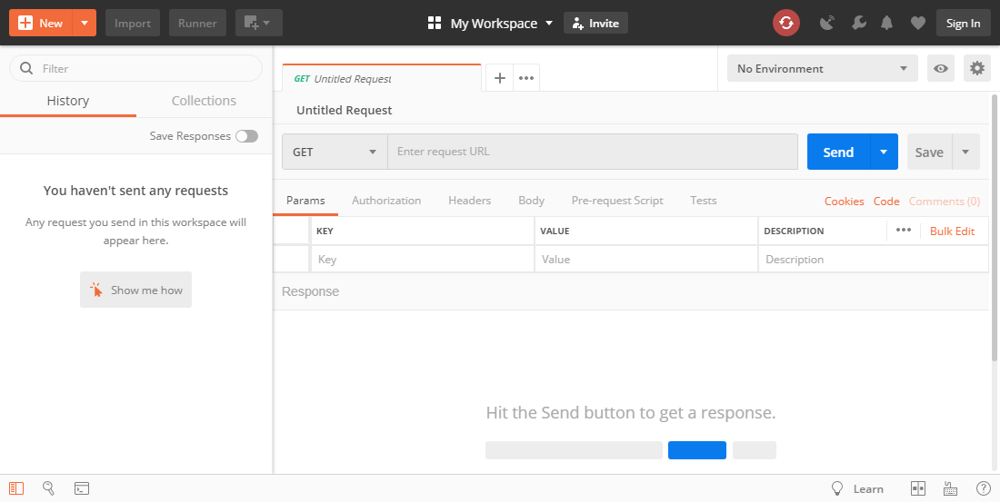

Basic interface:

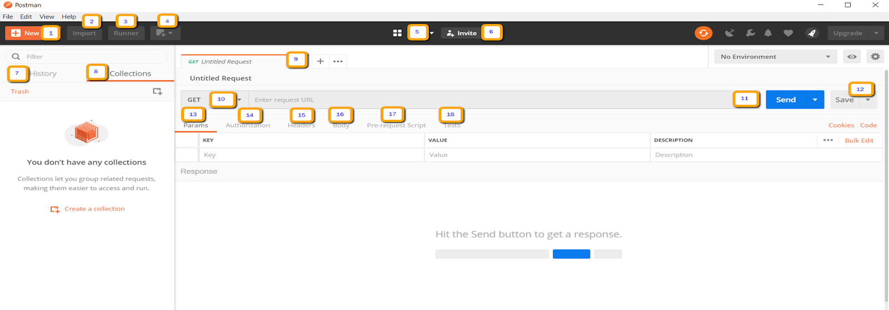

1. **New** - This is where you will create a new request, collection or environment.
2. **Import** - This is used to import a collection or environment. There are options such as import from file, folder, link or paste raw text.
3. **Runner** - Automation tests can be executed through the Collection Runner. This will be discussed further in the next lesson.
4. **Open New** - Open a new tab, Postman Window or Runner Window by clicking this button.
5. **My Workspace** - You can create a new workspace individually or as a team.
6. **Invite** - Collaborate on a workspace by inviting team members.
7. **History** - Past requests that you have sent will be displayed in History. This makes it easy to track actions that you have done.
8. **Collections** - Organize your test suite by creating collections. Each collection may have subfolders and multiple requests. A request or folder can also be duplicated as well.
9. **Request tab** - This displays the title of the request you are working on. By default, "Untitled Request" would be displayed for requests without titles.
10. **HTTP Request** - Clicking this would display a dropdown list of different requests such as GET, POST, COPY, DELETE, etc. In testing, the most commonly used requests are GET and POST.
11. **Request URL** - Also known as an endpoint, this is where you will identify the link to where the API will communicate with.
12. **Save** - If there are changes to a request, clicking save is a must so that new changes will not be lost or overwritten.
13. **Params** - This is where you will write parameters needed for a request such as key values.
14. **Authorization** - In order to access APIs, proper authorization is needed. It may be in the form of a username and password, bearer token, etc.
15. **Headers** - You can set headers such as content type JSON depending on the needs of the organization.
16. **Body** - This is where one can customize details in a request commonly used in POST request.
17. **Pre-request Script** - These are scripts that will be executed before the request. Usually, pre-request scripts for the setting environment are used to ensure that tests will be run in the correct environment.
18. **Tests** - These are scripts executed during the request. It is important to have tests as it sets up checkpoints to verify if response status is ok, retrieved data is as expected and other tests.

------

<!-- ## Basic Requests -->

<!-- ### GET Requests -->

<!-- ### POST Requests -->

<!-- ## Parameterized Data -->

## Tests

For a lot of people, Postman is synonymous with API testing. For some, that might mean sending and inspecting a response. It could also mean writing assertions to validate that an endpoint is returning the appropriate responses. Or, it can also mean setting up logic to mirror your workflow and automating the tests.

The easiest way to get started with writing tests in Postman is to take a look at the snippets on the right side of the Tests tab. Clicking on a snippet will append the JavaScript code into the editor. You can also write your own test code.

The idea is that in many cases you will need to do something with the response and extract a variable from it in order to use it at a later stage. This can be done in “Tests” tab.

Without good tests, it’s impossible to have full confidence in your API’s behavior, consistency, or backward compatibility. As your codebase grows and changes over time, tests will save you time and frustration by spotting breaking changes.

Writing tests in Postman is easy and uses JavaScript syntax. Testing simple things, like HTTP status codes, response times, and headers can each be done in a single line of code

Many people use Postman Collections to document their APIs, either as a collection of example requests that can be easily shared among team members, or as public API documentation for customers. For both of those use cases, it makes sense for your collection to contain detailed explanations for each of your API endpoints, walkthroughs of common API workflows, authentication requirements, lists of possible error responses, etc.

A solid test suite will include many edge cases, intentional bad inputs (to test error handling), and possibly reveal sensitive information, all of which would be irrelevant or confusing for your API’s consumers.

For all of these reasons, I highly recommend that you keep your API tests in a separate collection from your API documentation.

------

<!-- ## JSON Schema Validation -->

<!-- ## Collections -->

## Collection Runner

There are two ways to run a collection which is the Collection Runner and Newman. Let's begin by executing the collection in Collection Runner.

Click on the Runner button found at the top of the page next to the Import button:

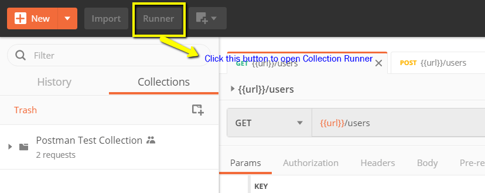

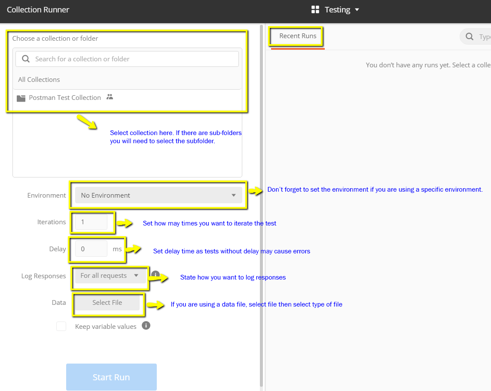

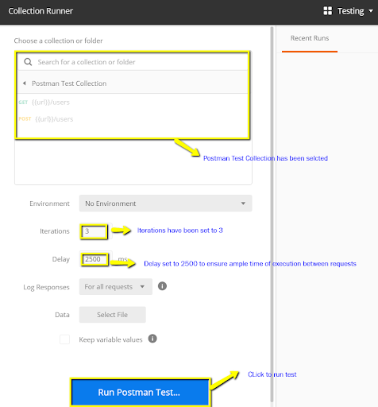

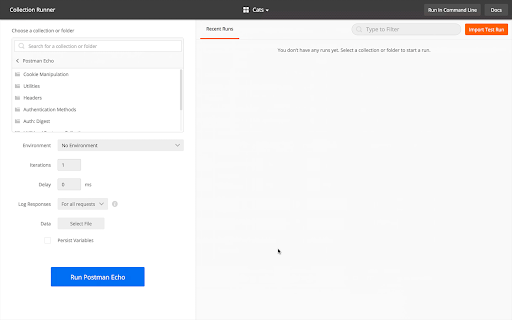

Results:

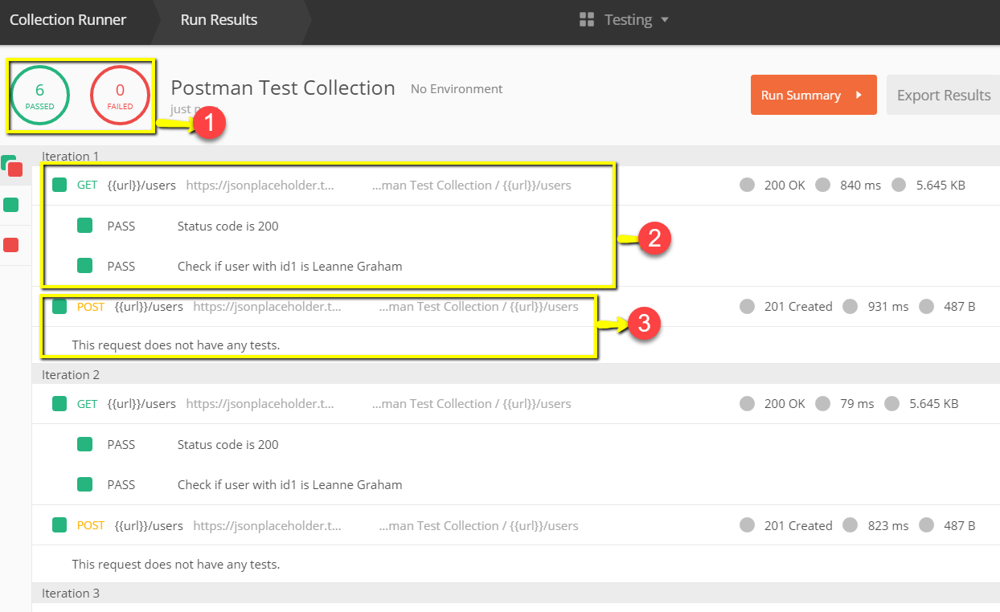

1. Once tests have finished, you can see the test status if it is Passed or Failed and the results per iteration.
2. You see Pass status for the Get Requests
3. Since we did not have any tests for Post, there should be a message that the request did not have any tests.

------

## Newman

Another way to run a collection is via Newman. The main differences between Newman and Collection Runner are the following:

1. Newman is an add-on for Postman. You will need to install it separately from the Native App.
2. Newman uses the command line while Collection Runner has a GUI.
3. Newman can be used for continuous integration.

To install Newman and run our collection from it, do the following:

1. Install NodeJS using this link: http://nodejs.org/download/
2. Open the command line and enter: `npm install -g newman`

Once Newman has been installed, go back to the Postman workspace. In the Collections box, click on the three dots. Options should now appear. Select Export.

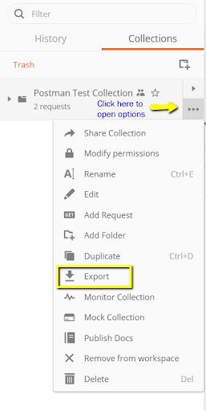

Choose Export Collection as Collection v2.1 (Recommended) then click Export.

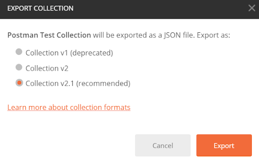

Select your desired location then click Save.

We will also need to export our environment. Click on the eye icon beside the environment dropdown in Global, select Download as JSON. Select your desired location then click Save. It is advisable that the environment should be in the same folder as your collection.

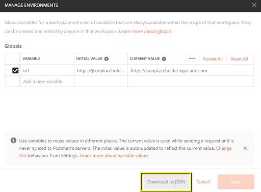

### View of Newman running a collection

Now go back to command line and change the directory to where you have saved the collection and environment.
Ex: `cd C:\Users\Asus\Desktop\Postman Tutorial`

Run your collection using this command:
`newman run PostmanTestCollection.postman_collection.json -e Testing.postman_globals.json`

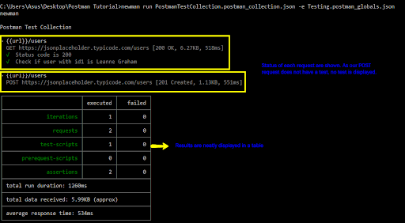

Here is a reference to some basic Newman codes for execution:

1. **Run a collection only**. This can be used if there is no environment or test data file dependency. `newman run <collection name>`
2. **Run a collection and environment**. The -e indicator is for environment. `newman run <collection name> -e <environment name>`
3. **Run a collection with desired no. of iterations**. `newman run <collection name> -n <no.of iterations>`
4. **Run with data file**. `newman run <collection name> --data <file name>  -n <no.of iterations> -e <environment name>`
5. **Set delay time**. This is important as tests may fail if it is run without delay due to requests being started without the previous request completing processing on the endpoint server. `newman run <collection name> -d <delay time>`

------

## Monitors

You can use Postman Monitors to automatically run your Postman tests at regular intervals, such as every night, or every 5 minutes. You’ll automatically be notified if any of your tests ever fail, and you can even integrate with a variety of third-party services, such as PagerDuty, Slack, Datadog, and more.

Postman Monitors shows your test results in the same familiar layout as the Postman collection runner, so it’s easy to compare the results to the Postman app.

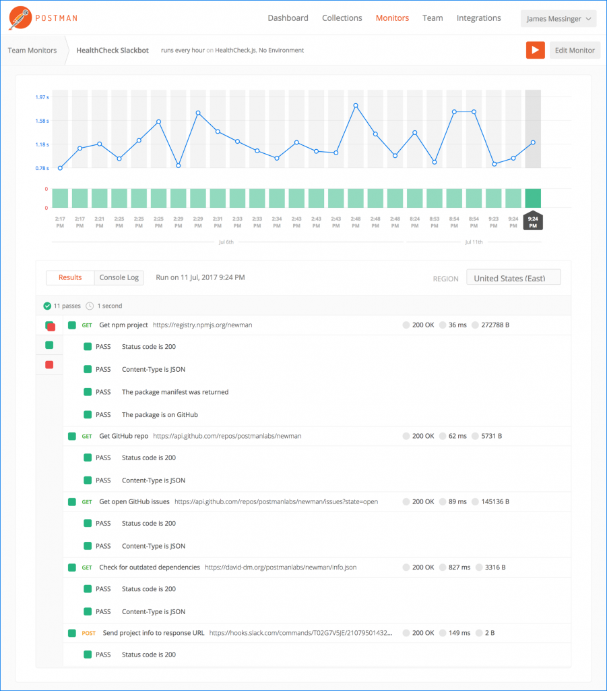

------

## Dynamic Workflows

By default, the Postman collection runner, Newman, and Postman Monitors will run each request in your collection in order. But you can use the postman.setNextRequest() function to change the order. This allows you to conditionally skip certain requests, repeat requests, terminate the collection early, etc.

```js
var customer = JSON.parse(responseBody);

if (customer.id === undefined) {
  // No customer was returned, so don't run the rest of the collection
  postman.setNextRequest(null);
}
else {
  // Save the customer ID to a Postman environment variable
  postman.setEnvironmentVariable("cust_id", customer.id);

  // The "Edit Customer" request uses the "cust_id" variable
  postman.setNextRequest('Edit Customer');
}
```

------

## Mock Servers

Delays on the front- or back-end make it difficult for dependent teams to complete their work efficiently. Postman's mock servers can alleviate those delays in the development process.

Before sending an actual request, front-end developers can create a mock server to simulate each endpoint and its corresponding response in a Postman Collection. Developers can view potential responses, without spinning up a back end.

Mock servers are public by default. Public mock servers are accessible to anyone.

Private mock servers require users to add a Postman API key in the request header x-api-key, like: x-api-key\:\<your postman API key>.

### Creating a Mock Server

1. In the header toolbar, click the New button.
2. The Create New tab appears.
3. Click "Mock Server".

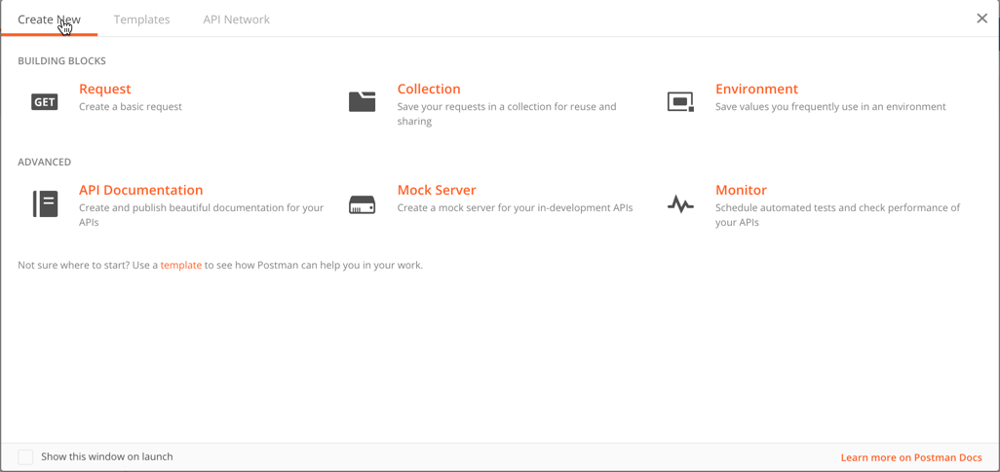

Follow the rest of the instructions to set up the mock server.
